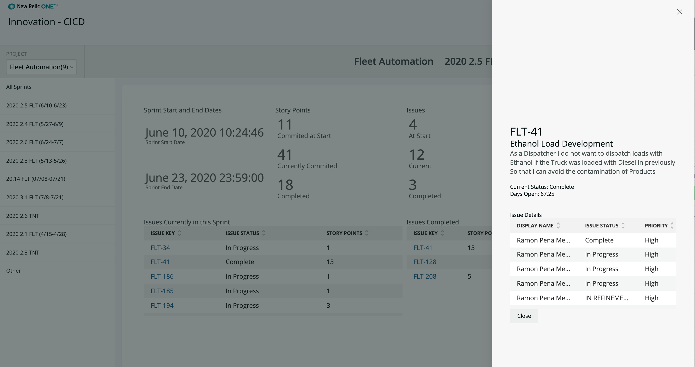

[](https://opensource.newrelic.com/oss-category/#new-relic-experimental)

# nr1-innovation-cicd nerdpack

>This nerdpack serves to provide a view of CICD information from a Jira Webhook integration.



## Installation

>Follow the **Getting started** instructions below.

## Getting started
1. First, ensure that you have [Git](https://git-scm.com/book/en/v2/Getting-Started-Installing-Git) and [NPM](https://www.npmjs.com/get-npm) installed. If you're unsure whether you have one or both of them installed, run the following commands. If you have them installed these commands will return a version number, if not, the commands won't be recognized:
```bash
git --version
npm -v
```
2. Install the [NR1 CLI](https://one.newrelic.com/launcher/developer-center.launcher) by going to [this link](https://one.newrelic.com/launcher/developer-center.launcher) and following the instructions (5 minutes or less) to install and set up your New Relic development environment.
3. Clone this repository and run the code locally against your New Relic data by running the following command:

```bash
nr1 nerdpack:clone -r https://github.com/newrelic/nr1-nerdpack-layout-standard.git
cd nr1-innovation-cicd
nr1 nerdpack:serve
```

Visit [https://one.newrelic.com/?nerdpacks=local](https://one.newrelic.com/?nerdpacks=local), navigate to the Nerdpack, and :sparkles:

## Deploying this Nerdpack

Open a command prompt in the nerdpack's directory and run the following commands.

```bash
# If you need to create a new uuid for the account to which you're deploying this Nerdpack, use the following
# nr1 nerdpack:uuid -g [--profile=your_profile_name]
# to see a list of APIkeys / profiles available in your development environment, run nr1 credentials:list
nr1 nerdpack:publish [--profile=your_profile_name]
nr1 nerdpack:deploy [-c [DEV|BETA|STABLE]] [--profile=your_profile_name]
nr1 nerdpack:subscribe [-c [DEV|BETA|STABLE]] [--profile=your_profile_name]
```

Visit [https://one.newrelic.com](https://one.newrelic.com), navigate to the Nerdpack, and :sparkles:

<!-- ## Usage
>[**Optional** - Include more thorough instructions on how to use the software. This section might not be needed if the Getting Started section is enough. Remove this section if it's not needed.] -->


<!-- ## Building

>[**Optional** - Include this section if users will need to follow specific instructions to build the software from source. Be sure to include any third party build dependencies that need to be installed separately. Remove this section if it's not needed.] -->

<!-- ## Testing

>[**Optional** - Include instructions on how to run tests if we include tests with the codebase. Remove this section if it's not needed.] -->

## Support

New Relic has open-sourced this project. This project is provided AS-IS WITHOUT WARRANTY OR DEDICATED SUPPORT. Issues and contributions should be reported to the project here on GitHub.

We encourage you to bring your experiences and questions to the [Explorers Hub](https://discuss.newrelic.com) where our community members collaborate on solutions and new ideas.

<!-- New Relic hosts and moderates an online forum where customers can interact with New Relic employees as well as other customers to get help and share best practices. Like all official New Relic open source projects, there's a related Community topic in the New Relic Explorers Hub. You can find this project's topic/threads here:

>Add the url for the support thread here -->

## Contributing
We encourage your contributions to improve nr1-innovation-cicd##! Keep in mind when you submit your pull request, you'll need to sign the CLA via the click-through using CLA-Assistant. You only have to sign the CLA one time per project.
If you have any questions, or to execute our corporate CLA, required if your contribution is on behalf of a company,  please drop us an email at opensource@newrelic.com.

**A note about vulnerabilities**

As noted in our [security policy](../../security/policy), New Relic is committed to the privacy and security of our customers and their data. We believe that providing coordinated disclosure by security researchers and engaging with the security community are important means to achieve our security goals.

If you believe you have found a security vulnerability in this project or any of New Relic's products or websites, we welcome and greatly appreciate you reporting it to New Relic through [HackerOne](https://hackerone.com/newrelic).

## License
[Project Name] is licensed under the [Apache 2.0](http://apache.org/licenses/LICENSE-2.0.txt) License.
>[If applicable: The [project name] also uses source code from third-party libraries. You can find full details on which libraries are used and the terms under which they are licensed in the third-party notices document.]
